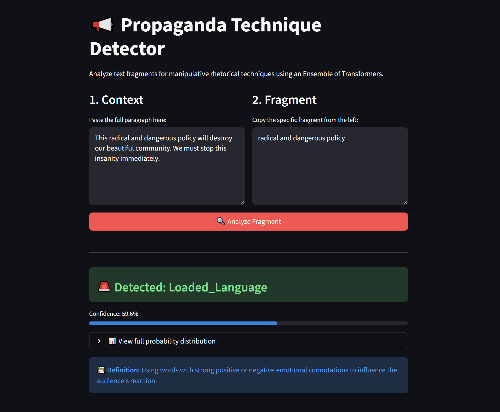
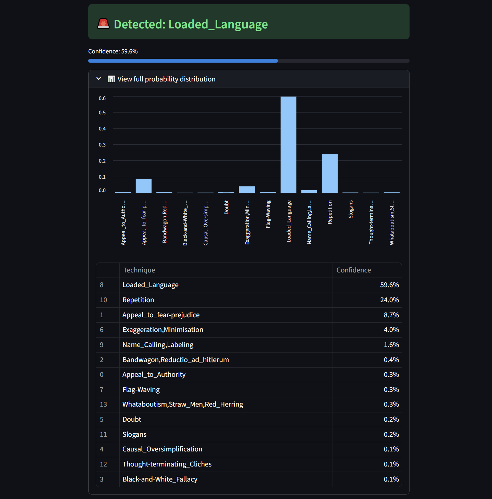

# 📢 Propaganda Technique Detector

This project implements a robust **Ensemble Learning system** to detect and classify **14 propaganda techniques** in news articles. Based on the **SemEval-2020 Task 11** challenge, the solution leverages advanced NLP techniques, including Context-Aware Tagging and Stacking, to analyze manipulative rhetoric.

### 👉 [Try the Live Demo Here](https://huggingface.co/spaces/hannusia123123/propaganda-detector) 👈

### 📸 Interface Preview

  
  

---

## 🧠 System Architecture

The solution uses a **Two-Level Stacking Ensemble** approach to maximize generalization and handle the nuances of propaganda.

### **Level 1: Base Learners (Transformers)**
I fine-tuned diverse Transformer architectures to capture different linguistic features. Instead of relying on a single model, I combined the strengths of four distinct architectures:

| Model | Role in Ensemble |
| :--- | :--- |
| **DeBERTa-v3-base** | **The Brain.** Uses disentangled attention, providing SOTA performance on logical fallacies and subtle manipulation. |
| **RoBERTa-base** | **The Baseline.** Provides robust semantic understanding and stability to the ensemble. |
| **XLNet-base** | **The Context Keeper.** Autoregressive formulation helps capture longer-range dependencies in complex articles. |
| **ToxicBERT** | **The Specialist.** Specifically included to detect aggressive techniques like *Name Calling* and *Loaded Language*. |

### **Level 2: Meta-Learner (Stacking)**
* **CatBoost Classifier:** Aggregates the probability vectors from all Level 1 models. Unlike simple averaging, CatBoost learns **which model to trust** for specific classes (e.g., trusting ToxicBERT for insults, but DeBERTa for logical errors).

---

## 🛠️ Engineering & Methodology

### 1. Context-Aware Preprocessing
Propaganda often depends on context (e.g., sarcasm). Feeding only the target fragment to the model is insufficient.
* **Solution:** I isolate the **specific sentence** containing the target fragment and enclose the fragment in special tags `<E>` and `</E>`.
* **Example:** `Other unforeseen events also surrounded the summit, <E>increasing the drama</E> .`
* **Benefit:** This allows the Transformer's attention mechanism to focus on the fragment while seeing the surrounding context.

### 2. Training Strategy (GPU P100)
* **Cross-Validation:** Models were trained using **5-Fold Cross-Validation** to generate unbiased Out-of-Fold (OOF) predictions.
* **Experiment Tracking:** All runs, loss curves, and hyperparameters were rigorously tracked using **Weights & Biases (W&B)**.
* **Loss Function:** Weighted Cross-Entropy was used to handle the severe class imbalance.

### 3. Production Optimization
During the research phase, the full ensemble consisted of **20 models** (4 architectures × 5 folds).
* **Optimization:** For the deployment on Hugging Face Spaces, the system was optimized for **low latency**.
* **Distillation:** I selected the top-performing checkpoint from each architecture, reducing the ensemble to **4 models**. This ensures real-time inference on CPU without significant degradation in F1-score.

---

## 📊 Supported Techniques
The system detects the following 14 classes:
* *Appeal to Authority*
* *Appeal to Fear/Prejudice*
* *Bandwagon & Reductio ad Hitlerum*
* *Black-and-White Fallacy*
* *Causal Oversimplification*
* *Doubt*
* *Exaggeration/Minimisation*
* *Flag-Waving*
* *Loaded Language*
* *Name Calling/Labeling*
* *Repetition*
* *Slogans*
* *Thought-terminating Cliches*
* *Whataboutism/Straw Men/Red Herring*

---

## 🏆 Performance & Results

The primary optimization metric was **Macro-F1 Score** to account for the class imbalance, while **Micro-F1 (Accuracy)** was tracked for overall performance.
Based on the **5-Fold Cross-Validation** results on the holdout set, the Stacking Ensemble demonstrated superior generalization compared to individual models.

| Model / Approach | Micro-F1 (Accuracy) | Macro-F1 | Notes |
| :--- | :--- | :--- | :--- |
| **ToxicBERT** | 0.491 | 0.392 | Specialized model. Weak on its own but captures aggressive language features. |
| **XLNet-base** | 0.687 | 0.562 | Good context handling, but slightly lower precision than RoBERTa. |
| **RoBERTa-base** | 0.692 | 0.581 | Strong baseline with balanced performance across classes. |
| **DeBERTa-v3-base** | 0.693 | 0.588 | Best single model. Disentangled attention improves detection of logical fallacies. |
| **Stacking Ensemble** | **0.697** | **0.610** | CatBoost effectively combines predictions, yielding a **+2.2% boost in Macro-F1** over the best single model. |

**Why Ensemble?**
While the accuracy gain (+0.4%) seems marginal, the **Macro-F1 boost (+2.2%)** proves that the ensemble creates a much more balanced classifier. It successfully leverages specialized models (like ToxicBERT) to correct errors on specific classes that general models miss.

> **Note on Production:** The values above represent the performance of the full research ensemble (20 models). For the deployed Hugging Face Space, I distilled the system to **4 diverse models** (one per architecture) to ensure real-time inference, maintaining ~99% of this accuracy.

### 🔬 Class-Level Performance Analysis

👉 <strong>Click to expand the full comparison table (14 classes)</strong>

The table below demonstrates the <strong>F1-Score per class</strong> across all models.
Note how the <strong>Ensemble (Stacking)</strong> significantly outperforms individual models on difficult classes like <em>Slogans</em> and <em>Black-and-White Fallacy</em>, where single models struggle.

| Technique (Class) | ToxicBERT | XLNet | RoBERTa | DeBERTa v3 | 🏆 Ensemble |
| :--- | :---: | :---: | :---: | :---: | :---: |
| *Appeal to Authority* | 0.41 | 0.63 | 0.67 | 0.61 | **0.65** |
| *Appeal to Fear-Prejudice* | 0.38 | 0.53 | 0.57 | 0.47 | **0.52** |
| *Bandwagon* | 0.44 | 0.53 | 0.46 | 0.62 | **0.59** |
| *Black-and-White Fallacy* | 0.11 | 0.35 | 0.55 | 0.50 | **0.67** 🚀 |
| *Causal Oversimplification* | 0.27 | 0.50 | 0.44 | 0.46 | **0.47** |
| *Doubt* | 0.46 | 0.58 | 0.62 | 0.71 | **0.63** |
| *Exaggeration/Minimisation* | 0.28 | 0.50 | 0.56 | 0.48 | **0.55** |
| *Flag-Waving* | 0.57 | 0.78 | 0.63 | 0.70 | **0.69** |
| *Loaded Language* | 0.61 | 0.82 | 0.82 | 0.81 | **0.82** |
| *Name Calling/Labeling* | 0.63 | 0.85 | 0.84 | 0.83 | **0.84** |
| *Repetition* | 0.27 | 0.50 | 0.53 | 0.50 | **0.48** |
| *Slogans* | 0.56 | 0.64 | 0.69 | 0.70 | **0.80** 🚀 |
| *Thought-terminating Cliches* | 0.27 | 0.43 | 0.48 | 0.53 | **0.50** |
| *Whataboutism* | 0.22 | 0.24 | 0.29 | 0.30 | **0.33** |

> **Key Insight:** While base models like DeBERTa struggle with specific logical fallacies (e.g., *Black-and-White Fallacy* ~0.50), the Ensemble learns to correct these errors, boosting the score to **0.67**. Similarly, for *Slogans*, the Ensemble achieves **0.80**, surpassing the best single model by 10 points.

---

## 🕹️ How to Use the App

Since propaganda relies heavily on context, the model requires two inputs:

1.  **Context:** Paste the full sentence or paragraph containing the manipulation.
2.  **Fragment:** Copy and paste the **specific phrase** (span) from the context that you want to analyze.
3.  **Click "Analyze":** The model will evaluate the fragment within its context.

> **Important:** The *Fragment* must be an exact substring of the *Context*.

## 📝 Try it yourself! (Example Inputs)

To test the model, copy the text into the **Context** field and the specific phrase into the **Fragment** field in the app.

| Technique | Context Input (Paste this first) | Fragment Input (Paste this second) |
| :--- | :--- | :--- |
| **🤬 Name Calling** | `The greedy vultures in the city council only care about their own pockets, not the citizens.` | `greedy vultures` |
| **😱 Appeal to Fear** | `If we don't act now, thousands of criminals will swarm our streets by tomorrow morning.` | `thousands of criminals will swarm our streets` |
| **🚩 Slogans** | `Our party believes in a better life for all. Forward together, stronger than ever!` | `Forward together, stronger than ever!` |
| **⚖️ Black-and-White** | `You are either with us in this fight, or you are on the side of the enemy.` | `either with us in this fight, or you are on the side of the enemy` |
| **🤷 Whataboutism** | `You criticize our environmental record, but what about the corruption in your own office?` | `what about the corruption in your own office` |

## ⚠️ Limitations & Known Constraints

### 1. The "Always Propaganda" Assumption (False Positives)
Currently, the system is designed strictly for **Technique Classification (SemEval Task 2)**. It operates under the assumption that the input fragment **already contains** a propaganda technique.
* **Issue:** Since the pipeline lacks a preliminary **Span Identification (Binary Classification)** step, it does not filter out neutral text.
* **Result:** If a user inputs a purely factual or neutral sentence, the model is forced to classify it into one of the 14 categories, leading to hallucinations (False Positives).

#### Examples of False Positives on Neutral Text:

| Neutral Input | Model's Forced Prediction | Why it happens (Model Bias) |
| :--- | :--- | :--- |
| *"According to the peer-reviewed study in the Journal of Physics..."* | **Appeal to Authority** | The model detects citation markers (*"According to"*, *"Journal"*) and classifies factual referencing as a manipulative appeal to authority. |
| *"Weather experts warn that heavy rainfall may cause localized flooding..."* | **Appeal to Fear** | The model reacts to danger-related keywords (*"warn"*, *"flooding"*) and interprets a factual safety warning as an attempt to induce fear. |
| *"The blue whale is officially recognized as the largest animal..."* | **Exaggeration/Minimisation** | The model flags superlatives (*"largest"*, *"ever lived"*) as hyperbole, failing to distinguish scientific fact from rhetorical exaggeration. |

> **User Advisory:** For best results, only input fragments where you already suspect manipulative intent.

## 🔮 Future Roadmap

To address the limitations above, the next development phase includes:

1.  **Stage 1: Span Identification Model (Binary Classifier)**
    * **Goal:** Train a separate BERT-based token classifier (BIO tagging) to detect *where* propaganda exists in a text.
    * **Architecture:** `Text -> [Propaganda / Non-Propaganda Filter] -> [Technique Classifier]`
    * **Impact:** This will solve the "False Positive" issue by rejecting neutral text before it reaches the classification model.

2.  **Explainability (XAI)**
    * Integrate SHAP or LIME to highlight exactly which words contributed to the decision (e.g., showing that the word "cowardly" triggered the *Name Calling* class).